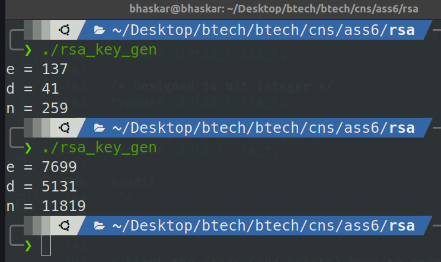
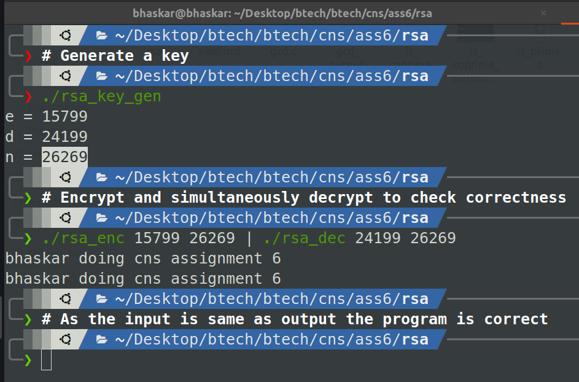

# A Simple RSA Algorithm

The implementation of RSA algorithm was divided into the following parts:
1. Key generation
2. Encryption
3. Decryption

|**Parameter**|**Value**|
|-|-|
|Plaintext block size|8 bits|
|Key length (size of **n**)|16 bits|
|Ciphertext block size|16 bits|

The implementation has the following programs:

1. **rsa_key_gen** - Generates the values of the public-private key components
i.e. the values of **e**, **d** and **n**.
2. **rsa_enc** - Encrypts the given plaintext message using the values of **e**
and **n** provided in the command line.
3. **rsa_dec** - Decrypts the given ciphertext message using the values of **d**
and **n** provided in the command line.

The following programs are implemented:

### RSA key generation (rsa_key_gen.h, rsa_key_gen.c and rsa_key_gen_drv.c)

* The **rsa_key_gen.h** and **rsa_key_gen.c** files provides the functions
for generating the keys.
* The algorithm is as follows:
    1. Generates two random 8 bit prime numbers whose product is greater than 256.
    Say p and q.
    2. Finds the value of n using p and q i.e. n = p x q.
    3. Finds the value of totient(n) = totient(p x q) = (p - 1) x (q - 1).
    4. Finds a random integer e, such that 1 \< e \< totient(n) and e and totient(n)
    are coprime.
    5. Finds a integer d, such that d is multiplicative inverse of e under modulo
    totient(n), using the extended euclidean algorithm.
* The **rsa_key_gen_drv.c** is a driver program to use the above discussed function
and print the values on the standard output for further use.

### RSA encryption-decryption (rsa_enc_dec.h, rsa_enc_dec.c and the driver files)

* The **rsa_enc_dec.h** and **rsa_enc_dec.c** files provide the functions to
encrypt and decrypt entire blocks of messages to their corresponding counterparts.
* The encryption function takes in an array of 8 bit blocks and encrypts them
to an array of 16 bit blocks. Similarly the decryption function takes in an array
of 16 bits blocks and decrypts them to an array of 8 bit plaintext blocks respectively.
* For encryption-decryption the modular exponentiation function has been implemented
for efficient calculation.
* The files **rsa_enc_drv.c** and **rsa_dec_drv.c** are the driver programs for
allowing the user to use the above implemented functions.

### RSA types (rsa_types.h)

The file provides the various data types used throughout the implementation.

### RSA program usage

* First the users (end-points) have to create their own pair of public and
private key components. For this they must run the key generation program.

* Then the sender will use the public components to encrypt the message and then
send the ciphertext to the end user.
* The receiver will now use the private components of the key to decrypt the message
in order to get the plaintext.

* To show the correctness of the encryption and decryption algorithms, we can
pipe the output of the encryption program to the decryption program and check
if the decrypted plaintext is same as the entered plaintext, if yes then the
program is correct.

